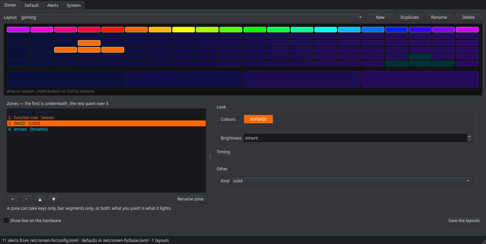
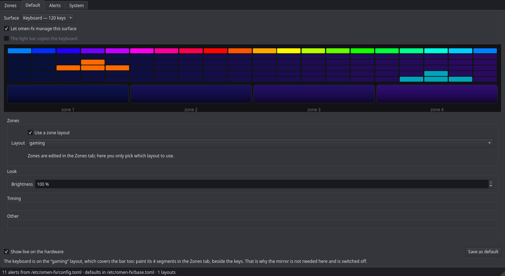
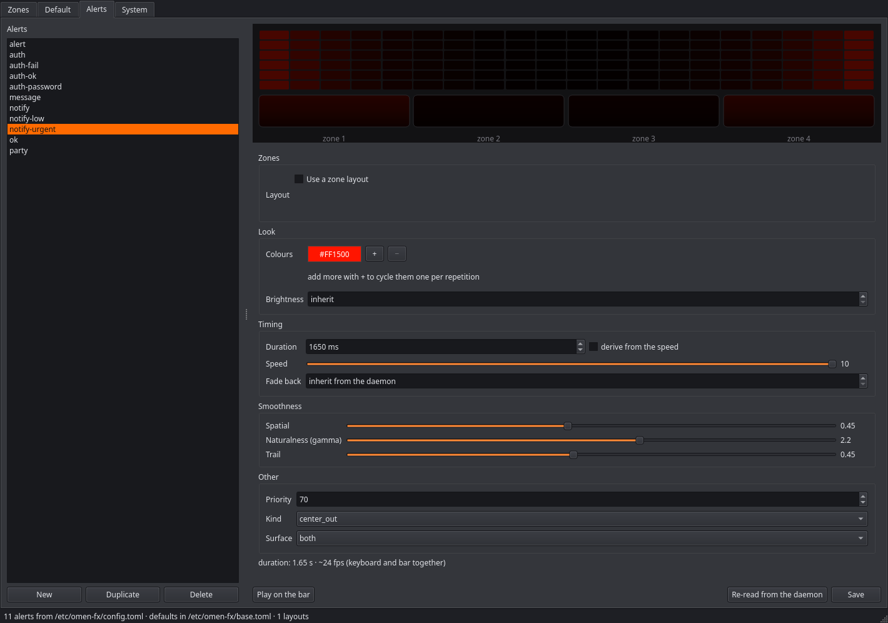
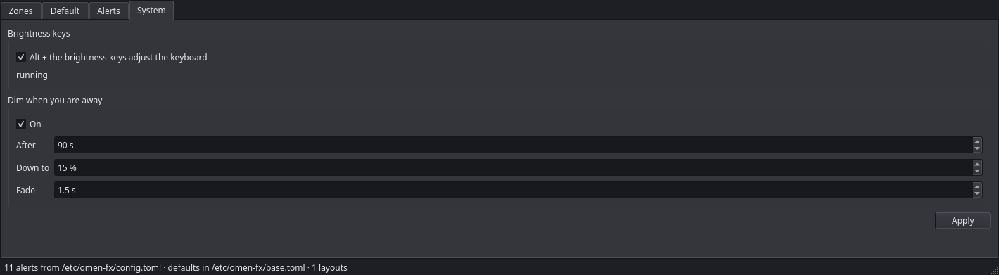

# omen-max-linux-rgb-keyboard-control

Full control of the lighting on an **HP OMEN MAX 16** under Linux: the 4-zone
light bar *and* the 120-lamp per-key keyboard, the brightness keys, and the
desktop's own keyboard-backlight slider.

Built for the MAX specifically. Its keyboard is not the 4-zone panel the rest
of the OMEN line has — it is a HID LampArray with a lamp behind every key, which
nothing else on Linux drives. The kernel driver started life as
[alessandromrc's omen-rgb-keyboard](https://github.com/OmenLinux/omen-rgb-keyboard)
and stays GPL-3.0; see [Credits and licence](#credits-and-licence).



*Paint regions of the keyboard, give each one its own effect. The strip under
the keys is the light bar: a zone can claim keys, bar segments, or both.*

## What it does

**Two lit surfaces, one picture.** The four "keyboard zones" the firmware
exposes actually drive the light bar; the keys are a separate device entirely.
Both are placed in one coordinate space, so an effect can sweep from the top of
the keyboard down onto the bar as one continuous surface.

**Zone layouts.** Paint regions of the keyboard — WASD, the function row, the
arrows — and give each its own effect. Later zones paint over earlier ones.

**Alerts.** Effects that interrupt the normal look and then fade back: desktop
notifications, `sudo` and polkit password prompts, or anything you drive from
the CLI. They carry priorities, so an urgent one wins, and duplicates collapse
instead of queueing up.

**The brightness keys.** Alt + the brightness keys move the keyboard backlight
instead of the screen — 5%, or 1% with Shift — and holding a key ramps. Plain
presses still drive the screen.

**Idle dimming.** The lights fade down after a spell of no input and come
straight back on the first keypress. It dims the rendering, not your brightness
setting, so the desktop's slider is left where you put it.

**Your desktop's slider works.** The driver's brightness is exported as a
standard `omen::kbd_backlight` LED, which is what every desktop shows as its
keyboard-backlight slider. It is read, never written, so moving it takes effect
live instead of snapping back to whatever the last effect asked for.

Kernel-side there is also a 4-zone RGB interface with 11 animation modes, the
Omen key mapped to `KEY_MSDOS`, and mute-LED sync — documented under
[Usage](#usage).

### The GUI

`omen-fx-gui` has four tabs. **Zones** is above. The other three:

<table>
<tr>
<td width="55%"></td>
<td><b>Default</b> — what the machine shows when nothing is happening. The
preview runs the same generator the daemon does, so it is not an
approximation, and <i>Show live on the hardware</i> puts it on the real
keyboard while you work.</td>
</tr>
<tr>
<td></td>
<td><b>Alerts</b> — effects that interrupt the default look: a notification, a
<code>sudo</code> password prompt, anything you hook up. They carry
priorities, so an urgent one wins, and they fade back afterwards.</td>
</tr>
<tr>
<td></td>
<td><b>System</b> — Alt + the brightness keys drive the keyboard backlight (5%,
or 1% with Shift, and holding a key ramps), and the lights dim after a spell
of no input. Dimming scales the <i>rendering</i>, so your own brightness
setting is left exactly where you put it.</td>
</tr>
</table>

## Tested on

**One machine: my own personal laptop, and nothing else.** Everything in this
repository was written and verified there. "OMEN 16" covers a dozen different
keyboards, so the machine is listed in full rather than by marketing name:

```
OS:         Arch Linux x86_64
Host:       OMEN MAX Gaming Laptop 16-ah0xxx   (board 8D41, family 103C_5335M7)
Kernel:     Linux 7.1.11-arch1-1
DE:         KDE Plasma 6.7.4 · KWin (Wayland)
CPU:        Intel Core Ultra 7 255HX (8+12)
GPU:        NVIDIA GeForce RTX 5070 Ti Mobile · Intel Arrow Lake-S graphics
Memory:     16 GB
BIOS:       Insyde F.23 (15.23)
EC:         38.46
Keyboard:   0d62:54bf Darfon "HP Gaming Keyboard II"
            HID LampArray, 120 lamps, 342 x 125 mm, 30 Hz update cap
Light bar:  4 WMI zones, through omen_rgb_keyboard 1.5
Suspend:    s2idle, with acpi_x86.sleep_no_lps0=1 — see Troubleshooting,
            "Fn Keys and Backlight Die After Suspend"
```

That is the whole tested list: one laptop, one BIOS, one kernel. Other OMEN MAX
machines are likely to work — the processor and graphics differ between them and
none of this touches either — but *likely* is not *tested*, so they are not
listed. If yours works, or does not, say so and the table will grow: an issue,
or the address below.

The BIOS and EC versions are there because the light bar goes through WMI, and
WMI is firmware: if an update ever breaks it, that is the line to check first.

---

## Installation

### Prerequisites

```bash
# Arch Linux
sudo pacman -S linux-headers base-devel alsa-lib

# Fedora
sudo dnf install kernel-devel kernel-headers @development-tools dkms alsa-lib-devel

# Ubuntu/Debian
sudo apt install linux-headers-$(uname -r) build-essential libasound2t64
```

**Note**: The ALSA libraries are required for the mute button LED control feature. The driver will still compile without them, but LED sync functionality will be disabled.

> [!IMPORTANT]
> **Do not blacklist `hp_wmi` for this driver.** Other OMEN projects tell you
> to, and with fan and power control in the mix that is sound advice: two
> drivers answering the same WMI GUID fight over it. This one does lighting
> only, so the overlap is gone — and on an OMEN MAX removing `hp_wmi` is a bad
> trade, because `hp_wmi` (or a patched build such as `hp-wmi-omen`) is what
> owns fan and power management. Take it away and the GPU sits at its floor.
>
> If you do hit a WMI conflict, that is worth an issue rather than a blacklist,
> so the overlap can be found and removed here instead.

### Build and Install
```bash
# Clone the repository
git clone https://github.com/mirco-g01/omen-max-linux-rgb-keyboard-control.git
cd omen-max-linux-rgb-keyboard-control

# Build and install
sudo make install
```

The module will be built and installed using DKMS, which will automatically rebuild it on kernel updates.

> [!NOTE]
> If you need to manually interact with DKMS, remember that the DKMS module name uses hyphens (`omen-rgb-keyboard`), while the loaded kernel module uses underscores (`omen_rgb_keyboard`).

### Automatic Loading on Boot
The driver is configured to load automatically on boot. If you need to set this up manually:

```bash
# Create modprobe configuration (for module options)
sudo cp omen_rgb_keyboard.conf /etc/modprobe.d/

# Create systemd module loading configuration
echo "omen_rgb_keyboard" | sudo tee /etc/modules-load.d/omen_rgb_keyboard.conf

# Create state directory
sudo mkdir -p /var/lib/omen-rgb-keyboard
```

Alternatively, use the provided installation script:
```bash
sudo ./install.sh
```

### Non-Root Access (Optional)

By default, controlling the RGB keyboard requires sudo privileges. To allow your user to control the RGB keyboard without sudo:

```bash
# Install udev rules and configure user permissions
sudo ./install-udev-rules.sh
```

This script will:
- Install udev rules that grant access to users in the 'input' group
- Add your user to the 'input' group automatically
- Reload udev rules to apply changes immediately

**Important:** After running this script, you need to log out and log back in (or run `newgrp input`) for the group membership to take effect.

After installation, you can control the keyboard without sudo:
```bash
# No sudo needed!
echo "rainbow" | tee /sys/devices/platform/omen-rgb-keyboard/rgb_zones/animation_mode
echo "5" | tee /sys/devices/platform/omen-rgb-keyboard/rgb_zones/animation_speed
```

## Usage

### Loading the Module
```bash
# Load the module
sudo modprobe omen_rgb_keyboard

# Check if it loaded successfully
lsmod | grep omen_rgb_keyboard
```

### Controlling RGB Lighting

The driver creates sysfs attributes in `/sys/devices/platform/omen-rgb-keyboard/rgb_zones/`:

#### Individual Zone Control
```bash
# Set zone 0 to red
echo "FF0000" | sudo tee /sys/devices/platform/omen-rgb-keyboard/rgb_zones/zone00

# Set zone 1 to green
echo "00FF00" | sudo tee /sys/devices/platform/omen-rgb-keyboard/rgb_zones/zone01

# Set zone 2 to blue
echo "0000FF" | sudo tee /sys/devices/platform/omen-rgb-keyboard/rgb_zones/zone02

# Set zone 3 to purple
echo "FF00FF" | sudo tee /sys/devices/platform/omen-rgb-keyboard/rgb_zones/zone03
```

#### All-Zone Control
```bash
# Set all zones to the same color
echo "FFFFFF" | sudo tee /sys/devices/platform/omen-rgb-keyboard/rgb_zones/all
```

#### Brightness Control
```bash
# Set brightness to 50%
echo "50" | sudo tee /sys/devices/platform/omen-rgb-keyboard/rgb_zones/brightness

# Set brightness to 100% (maximum)
echo "100" | sudo tee /sys/devices/platform/omen-rgb-keyboard/rgb_zones/brightness

# Turn off lighting (0% brightness)
echo "0" | sudo tee /sys/devices/platform/omen-rgb-keyboard/rgb_zones/brightness
```

#### Mute Button LED Control

The mute button LED is **automatically synchronized** with your system's mute state (polls every 200ms). When you mute audio, the LED turns on; when unmuted, it turns off.

**For HDA/ALSA audio devices:**
The driver automatically monitors ALSA controls (Master, Speaker, Headphone, PCM) and syncs the LED.

**For PipeWire/Bluetooth devices:**
If you're using PipeWire or Bluetooth headphones, the mute monitor service is installed and enabled automatically.

**Check service status:**
```bash
# Check if service is running
systemctl --user status omen-mute-monitor.service

# View service logs
journalctl --user -u omen-mute-monitor.service -f

# Check if service is enabled
systemctl --user is-enabled omen-mute-monitor.service

# Restart service if needed
systemctl --user restart omen-mute-monitor.service
```

The service monitors PipeWire mute state using `wpctl` and notifies the kernel driver via sysfs. It runs as your user (for PipeWire access) and uses sudo only for sysfs writes if needed.

**Manual Control:**
```bash
# Manually turn mute button LED on (disables auto-sync)
echo "1" | sudo tee /sys/devices/platform/omen-rgb-keyboard/rgb_zones/mute_led

# Manually turn mute button LED off
echo "0" | sudo tee /sys/devices/platform/omen-rgb-keyboard/rgb_zones/mute_led

# Set mute state from userspace (for PipeWire/Bluetooth)
echo "1" | sudo tee /sys/devices/platform/omen-rgb-keyboard/rgb_zones/mute_state  # Muted
echo "0" | sudo tee /sys/devices/platform/omen-rgb-keyboard/rgb_zones/mute_state  # Unmuted
```

**Note**: Manual control via `mute_led` disables automatic synchronization until the driver is reloaded.

#### Reading Current Values
```bash
# Check current brightness
cat /sys/devices/platform/omen-rgb-keyboard/rgb_zones/brightness

# Check current animation mode
cat /sys/devices/platform/omen-rgb-keyboard/rgb_zones/animation_mode

# Check current animation speed
cat /sys/devices/platform/omen-rgb-keyboard/rgb_zones/animation_speed

# Check current zone colors
cat /sys/devices/platform/omen-rgb-keyboard/rgb_zones/zone00
cat /sys/devices/platform/omen-rgb-keyboard/rgb_zones/zone01
# etc...
```

### Color Format

Colors are specified in RGB hex format:
- `FF0000` = Red
- `00FF00` = Green
- `0000FF` = Blue
- `FFFFFF` = White
- `000000` = Black (off)

### Brightness Range

Brightness is specified as a percentage (0-100):
- `0` = Completely off
- `50` = 50% brightness
- `100` = Maximum brightness

### Animation Modes

The driver supports 11 different animation modes:

**Basic Modes:**
- **static** - No animation, static colors (default)
- **breathing** - Smooth breathing effect that fades in and out
- **rainbow** - Rainbow wave that cycles through all colors
- **wave** - Wave effect that moves across the zones
- **pulse** - Pulsing effect with varying intensity

**Advanced Modes:**
- **chase** - Lights follow each other in sequence across zones
- **sparkle** - Random sparkle effect with bright white flashes
- **candle** - Warm flickering candle effect with orange/red colors
- **aurora** - Aurora borealis effect with flowing green/blue waves
- **disco** - Disco strobe effect with bright multi-colored flashes
- **gradient** - Custom color cycling with per-zone-group configuration

### Animation Speed

Animation speed is controlled by a value from 1-10:
- `1` = Slowest animation
- `5` = Default speed
- `10` = Fastest animation

## Examples

### Gaming Setup
```bash
# Red gaming theme
echo "FF0000" | sudo tee /sys/devices/platform/omen-rgb-keyboard/rgb_zones/all
echo "75" | sudo tee /sys/devices/platform/omen-rgb-keyboard/rgb_zones/brightness
```

### Rainbow Effect
```bash
echo "FF0000" | sudo tee /sys/devices/platform/omen-rgb-keyboard/rgb_zones/zone00  # Red
echo "FF8000" | sudo tee /sys/devices/platform/omen-rgb-keyboard/rgb_zones/zone01  # Orange
echo "FFFF00" | sudo tee /sys/devices/platform/omen-rgb-keyboard/rgb_zones/zone02  # Yellow
echo "00FF00" | sudo tee /sys/devices/platform/omen-rgb-keyboard/rgb_zones/zone03  # Green
```

### Subtle White Lighting
```bash
echo "FFFFFF" | sudo tee /sys/devices/platform/omen-rgb-keyboard/rgb_zones/all
echo "25" | sudo tee /sys/devices/platform/omen-rgb-keyboard/rgb_zones/brightness
```

### Animation Examples
```bash
# Breathing red effect
echo "FF0000" | sudo tee /sys/devices/platform/omen-rgb-keyboard/rgb_zones/all
echo "breathing" | sudo tee /sys/devices/platform/omen-rgb-keyboard/rgb_zones/animation_mode
echo "3" | sudo tee /sys/devices/platform/omen-rgb-keyboard/rgb_zones/animation_speed

# Rainbow wave
echo "rainbow" | sudo tee /sys/devices/platform/omen-rgb-keyboard/rgb_zones/animation_mode
echo "5" | sudo tee /sys/devices/platform/omen-rgb-keyboard/rgb_zones/animation_speed

# Chase effect
echo "00FF00" | sudo tee /sys/devices/platform/omen-rgb-keyboard/rgb_zones/all
echo "chase" | sudo tee /sys/devices/platform/omen-rgb-keyboard/rgb_zones/animation_mode
echo "4" | sudo tee /sys/devices/platform/omen-rgb-keyboard/rgb_zones/animation_speed

# Sparkle effect
echo "FFFFFF" | sudo tee /sys/devices/platform/omen-rgb-keyboard/rgb_zones/all
echo "sparkle" | sudo tee /sys/devices/platform/omen-rgb-keyboard/rgb_zones/animation_mode
echo "2" | sudo tee /sys/devices/platform/omen-rgb-keyboard/rgb_zones/animation_speed

# Aurora effect (uses its own colors)
echo "aurora" | sudo tee /sys/devices/platform/omen-rgb-keyboard/rgb_zones/animation_mode
echo "3" | sudo tee /sys/devices/platform/omen-rgb-keyboard/rgb_zones/animation_speed

# Disco strobe effect
echo "disco" | sudo tee /sys/devices/platform/omen-rgb-keyboard/rgb_zones/animation_mode
echo "6" | sudo tee /sys/devices/platform/omen-rgb-keyboard/rgb_zones/animation_speed

# Candle effect (uses its own warm colors)
echo "candle" | sudo tee /sys/devices/platform/omen-rgb-keyboard/rgb_zones/animation_mode
echo "4" | sudo tee /sys/devices/platform/omen-rgb-keyboard/rgb_zones/animation_speed
```

### Gradient Animation
```bash
# Configure gradient: zones 0,1,2 cycle red→green→blue, zone 3 cycles purple→orange
echo "0,1,2:FF0000,00FF00,0000FF;3:800080,FFA500" | sudo tee /sys/devices/platform/omen-rgb-keyboard/rgb_zones/gradient_config

# Start gradient animation at speed 5
echo "gradient" | sudo tee /sys/devices/platform/omen-rgb-keyboard/rgb_zones/animation_mode
echo "5" | sudo tee /sys/devices/platform/omen-rgb-keyboard/rgb_zones/animation_speed
```

## Omen Key Mapping

The driver intercepts the Omen key press and maps it to `KEY_MSDOS`, allowing you to bind custom shortcuts to it.

### Setting Up Shortcuts

**GNOME:**
1. Open Settings → Keyboard → Keyboard Shortcuts
2. Click "+" to add a custom shortcut
3. Press the Omen key when prompted
4. Assign your desired action

**KDE Plasma:**
1. System Settings → Shortcuts → Custom Shortcuts
2. Edit → New → Global Shortcut → Command/URL
3. Set the trigger to the Omen key
4. Assign your command

**i3/Sway:**
Add to your config file:
```
bindsym XF86DOS exec your-command-here
```

### Customizing the Key Mapping

If you want to map the Omen key to a different key, edit `src/wmi/omen_wmi.c`:

```c
static const struct key_entry hp_wmi_keymap[] = {
    { KE_KEY, OMEN_KEY_SCANCODE, { KEY_MSDOS } },  // Change KEY_MSDOS to your preferred key
    { KE_END, 0 }
};
```

After changing, rebuild with `sudo make install`.

## Troubleshooting

### Module Not Loading
```bash
# Check if WMI is supported
sudo dmesg | grep -i wmi

# Check for errors
sudo dmesg | grep -i omen_rgb_keyboard
```

### No RGB Zones Found
```bash
# Verify the module loaded
lsmod | grep omen_rgb_keyboard

# Check sysfs path
ls -la /sys/devices/platform/omen-rgb-keyboard/rgb_zones/
```

### Fn Keys and Backlight Die After Suspend

If, after resuming, the keyboard backlight is dead **and** F2/F3/F4 stop
controlling brightness (on KDE they open System Settings instead), while every
other key still works — and a reboot does not fix it, only a full power off —
you are hitting the Modern Standby handover, not a driver bug.

The short version: entering s2idle the kernel calls the ACPI LPS0 `_DSM`, which
tells the HP firmware to hand those three keys to host software that exists on
Windows and not here. The fix is a kernel parameter:

```bash
# add to your kernel command line, then reboot
acpi_x86.sleep_no_lps0=1

# verify
cat /sys/module/acpi_x86/parameters/sleep_no_lps0   # must print Y
```

To confirm the diagnosis on your own machine first:

```bash
sudo scripts/omen-kbd-suspend-test trial
sudo scripts/omen-kbd-suspend-test ladder
```

The full write-up — what the firmware actually does, what the workaround costs,
how to keep the backlight off during sleep, and a list of dead ends so nobody
repeats them — is in
[docs/modern-standby-fn-keys.md](docs/modern-standby-fn-keys.md).

### Colors Not Changing
- Ensure you're using the correct hex format (6 characters, uppercase)
- Check that brightness is not set to 0
- Verify the module loaded without errors

### Secure Boot (Key was rejected by service)
If your Linux distribution enforces strict Secure Boot policies, the kernel will block unsigned drivers from loading, throwing an error like: `modprobe: ERROR: could not insert 'omen_rgb_keyboard': Key was rejected by service`.

To resolve this, you must sign the kernel module using a trusted Machine Owner Key (MOK) so your UEFI firmware allows it to load.

* **If you already have existing keys** (you may already have a MOK/key pair, common if you previously set up Secure Boot module signing, e.g. for NVIDIA drivers): Configure DKMS to use your existing private key and public certificate before running `dkms install`.
* **If you do not have a MOK**: You will need to generate a key pair, enroll it in your firmware via `mokutil`, and script DKMS to use it.

For instructions and automated scripts to handle MOK generation and DKMS signing, see the [Community DKMS Signing Guide](https://gist.github.com/sbueringer/bd8cec239c44d66967cf307d808f10c4) or the [Arch Wiki DKMS Documentation](https://wiki.archlinux.org/title/Dynamic_Kernel_Module_Support#Secure_Boot).


## Technical Details

- Driver Name: `omen-rgb-keyboard`
- WMI Interface: Uses HP's native WMI commands for maximum compatibility
- Buffer Layout: Matches HP's Windows implementation exactly
- Animation System: CPU-efficient timer-based updates with 20 FPS
- State Persistence: Saves settings to `/var/lib/omen-rgb-keyboard/state`
- Kernel Compatibility: Linux 5.0+

## Credits and licence

**GPL-3.0**, and it has to stay that way, because the kernel driver in `src/`
is not written from scratch. It began as
[OmenLinux/omen-rgb-keyboard](https://github.com/OmenLinux/omen-rgb-keyboard)
by **alessandromrc**, which is GPL-3.0, and every source file still carries its
`SPDX-License-Identifier: GPL-3` and author line. That project in turn credits
[hp-omen-linux-module](https://github.com/pelrun/hp-omen-linux-module) by
**James Churchill (@pelrun)**. The WMI work that makes any of this possible is
theirs.

This project is aimed somewhere else: only at the OMEN MAX, and at both of its
lit surfaces rather than one. What is different here:

**Added**

* `contrib/omen-fx` — the whole userspace layer: daemon, CLI, Qt GUI, per-key
  keyboard support through HID LampArray, zone layouts, alert effects, idle
  dimming, and the brightness keys. About 7,000 lines, none of it upstream's.
* A `zones` sysfs attribute that writes all four zones in **one** WMI get/set
  pair instead of four, taking a four-colour frame from ~860 ms to ~30 ms.
  Without it, animation is not possible at all.
* `animation_stop()` returns early when no animation was running, instead of
  repainting every zone on each write.

**Removed**

* Fan control (`src/fan/`, ~940 lines) and everything that fought `hp_wmi` for
  it. On an OMEN MAX, fans and power belong to `hp_wmi`; see the note in
  Installation. If you want fan control on a non-MAX OMEN, the upstream project
  has it and supports many more models.

If your machine is not an OMEN MAX, **go upstream first** — it is tested on far
more hardware than this is.

## Contributing

Issues and pull requests are welcome, especially from other OMEN MAX owners: a
second machine in the tested table would be worth a lot. Anything touching
fans, power limits or thermal profiles belongs in another project, not here.

## Support

If this saved you the trouble of writing it yourself, you can support the work
via [GitHub Sponsors](https://github.com/sponsors/mirco-g01) or
[Ko-fi](https://ko-fi.com/mircog01). Entirely optional — issues and PRs are
just as welcome either way.

## Contact

**mircog59@gmail.com** — write to me directly, in English or Italian.

Two things in particular are worth an email:

* **Something does not work.** Say which OMEN model you have, the output of
  `cat /sys/class/dmi/id/product_name`, your kernel version, and what happens.
  If it is the driver, add `dmesg | grep omen`.
* **Everything works.** This is genuinely as useful, and much rarer. All of the
  above has been verified on exactly one laptop, so a second machine confirming
  it turns "probably fine" into something I can actually put in the table above
  — with your model listed, if you are happy for it to be.

Opening an issue does the same job and leaves the answer where the next person
will find it, so prefer that when the problem is not specific to you. Use the
address when you would rather not, or when there is something to work through
back and forth.

## Disclaimer

Provided as-is, at your own risk. Nobody here is responsible for damage to your
hardware.
